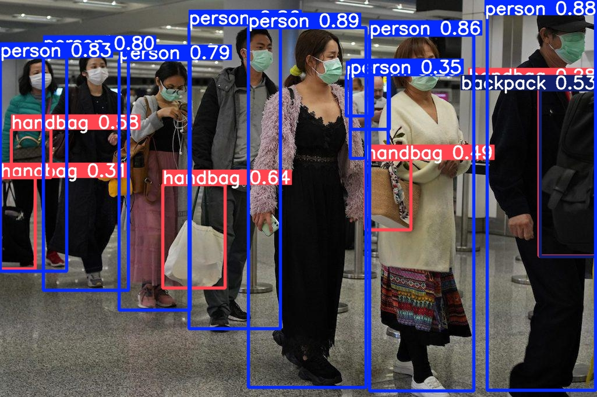

# ClearLabel AI  
### Automated Image Annotation & Data Quality Audit Pipeline

[](https://www.linkedin.com/in/aawhanvyas)
[](https://github.com/aawhan0)
[](https://auto-annotation-aawhan0.streamlit.app/)

---

## 🚀 Overview
**ClearLabel AI** is a data-centric AI pipeline that automates image annotation while enforcing strict data quality standards through a dual-layer audit system.

It is designed to reduce manual labeling effort while ensuring only high-quality, model-ready data enters the training pipeline.

---

## 🚀 The Problem
In production-level AI systems, **manual data labeling is the most expensive and time-consuming bottleneck**.

Raw datasets are often:
- Noisy  
- Blurry  
- Contain ambiguous or low-quality samples  

Training on such data directly leads to **poor model performance and unreliable predictions**.

---

## 🛠️ The Solution
ClearLabel AI introduces an **Automated Annotation & Quality Audit Pipeline** with a **Human-in-the-Loop architecture**.

It ensures:
- Only high-confidence, high-quality data is auto-labeled  
- Edge cases are intelligently routed for manual review  
- Dataset quality remains consistently high ("Gold Standard")

### 🔗 [Live Demo](https://auto-annotation-aawhan0.streamlit.app/)

---

## ⚡ Key Features
- ✅ Automated image annotation using YOLOv8  
- ✅ Dual-layer quality audit (Blur Detection + Confidence Filtering)  
- ✅ Human-in-the-loop review system  
- ✅ Production-ready YOLO format output  
- ✅ Modular pipeline for easy MLOps integration  
- ✅ Real-time interactive UI (Streamlit)  

---

## 🧠 Technical Methodology

### 1. Visual Quality Audit (OpenCV)
Before inference, images are evaluated using **Laplacian Variance**.

- **Logic:** Low variance → blurred/out-of-focus → flagged  
- **Impact:** Eliminates low-quality inputs before model training  

---

### 2. AI Confidence Audit (YOLOv8)
A YOLOv8 nano model performs high-speed object detection.

- **Auto-Accept:** Predictions with **>85% confidence** → saved  
- **Flagged:** Predictions with **<85% confidence** or no detection → `needs_review`  

---

<p align="center">
  
  <br>
  <b>Figure 1:</b> <i>Dual-layer audit system identifying low-confidence detections.</i>
</p>

---

## 📊 Business Impact
- **⚡ 70% reduction** in manual annotation workload  
- **📈 Improved dataset reliability** via automated quality checks  
- **🔁 Scalable pipeline** ready for MLOps workflows  
- **🧠 Data-centric approach** improves downstream model performance  

---

## 📈 Results
Using the Construction Site Safety dataset (v30):

- **Total Processed:** 717 images  
- **Auto-Accepted:** ~70% (High Confidence + High Clarity)  
- **Flagged for Review:** ~30% (Low Confidence / Blur / Ambiguity)  

---

## 📂 Project Structure
```text
ClearLabel-AI/
├── data/
│   ├── raw/             # Unlabelled images (Construction Safety Dataset)
│   ├── auto_labeled/    # Validated images & generated .txt labels
│   └── needs_review/    # Images flagged for Blur or Low Confidence
├── models/
│   └── yolov8n.pt       # Pre-trained YOLOv8 weights
├── src/
│   └── audit_pipeline.py # Main Audit & Annotation Logic
├── requirements.txt     # Project Dependencies
└── README.md            # Documentation
```
## ⚙️ Setup & Usage
1. Clone the repository
Open your terminal and run the following command to download the project:

```bash
git clone https://github.com/aawhan0/Auto-Annotation.git
cd Auto-Annotation
```
2. Install dependencies
Ensure you have Python installed, then install the required libraries:

```bash
pip install -r requirements.txt
```
3. Run the pipeline
Place your raw images in data/raw/ and execute the audit script:

```bash
python src/audit_pipeline.py
```

## 🔗 Resources & References
* **Dataset Source:** [Construction Site Safety (Roboflow)](https://universe.roboflow.com/roboflow-universe-projects/construction-site-safety)
* **Core Model:** [Ultralytics YOLOv8 Documentation](https://docs.ultralytics.com/)
* **Image Processing:** [OpenCV Laplacian Variance for Blur Detection](https://docs.opencv.org/4.x/d5/db5/tutorial_laplace_operator.html)
* **Data-Centric AI:** [Andrew Ng's Data-Centric AI Resource Hub](https://datacentricai.org/)

---
## 👤 Author
**Aawhan Vyas**  

[](https://www.linkedin.com/in/aawhanvyas)  
[](https://github.com/aawhan0)
